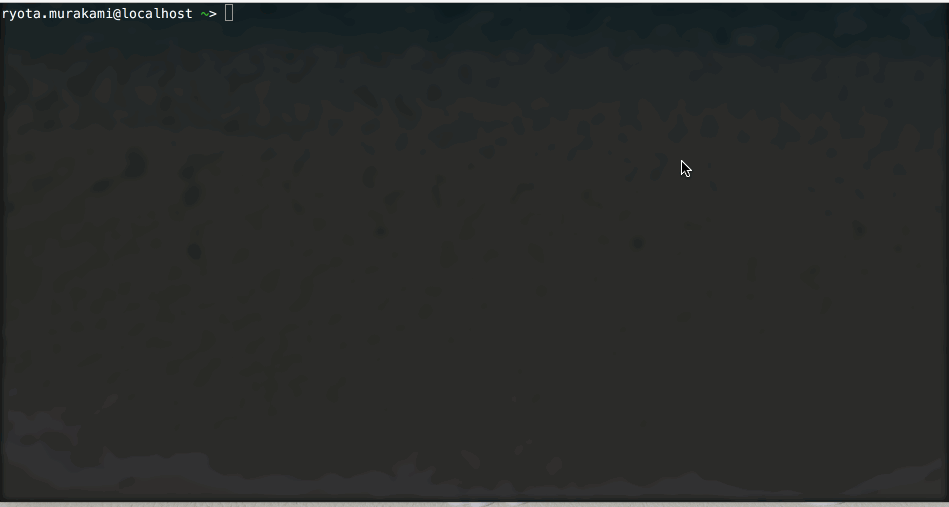

# Twitter Bearer Token Getter

[](https://travis-ci.org/ryota-murakami/twitter-bearer-token-getter)
[](https://packagist.org/packages/ryota-murakami/twitter-bearer-token-getter)
[](https://packagist.org/packages/ryota-murakami/twitter-bearer-token-getter)
[](https://packagist.org/packages/ryota-murakami/twitter-bearer-token-getter)

This is a CLI tool for developers using twitter api.



In order to acquire a bearer token, you need to send a POST request directly to the endpoint of twitter api.  
[Official document of bearer token](https://dev.twitter.com/oauth/reference/post/oauth2/token)

We have to send some information to the 'Authorization' HTTP Header with credentialization, the process is a little troublesome.

It is a tool to alleviate such trouble and to obtain a bearer token easily.

# Preparation
1. Consumer Key(API Key)
2. Consumer Secret (API Secret)

# Installation

```
composer global require ryota-murakami/twitter-bearer-token-getter
```

If you have not gone yet, so please do the following.

```
export PATH="$PATH:$HOME/.composer/vendor/bin"
```

# Run

```
twitter-bearer-token-getter
```

After Run,  
You will be prompted for the consumer key and consumer secret interactively at the terminal so please enter them according to the console message.

If the above two information are correctly entered, a bearer token will be displayed on the terminal.
